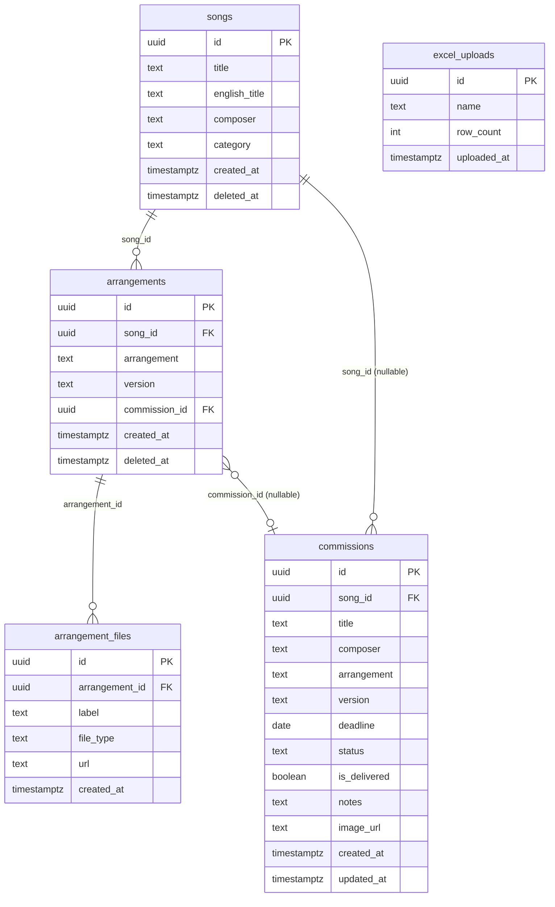

# DB 스키마

Supabase PostgreSQL 기반. RLS(Row Level Security)로 사용자별 데이터 격리.

## 테이블 구성

```
songs              곡 카탈로그
arrangements       편성 (song_id FK)
arrangement_files  편성 첨부 파일 (arrangement_id FK)
commissions        의뢰 원장 (song_id FK, nullable)
excel_uploads      Excel 판매 보고서 업로드 이력
```

---

## songs

곡 카탈로그. 편성과 의뢰의 기준 식별자.

| 컬럼 | 타입 | 제약 | 비고 |
|------|------|------|------|
| id | uuid | PK, default gen_random_uuid() | |
| title | text | NOT NULL | 곡명 |
| english_title | text | nullable | 영문 제목 |
| composer | text | NOT NULL | 작곡가명 |
| category | text | nullable | CLASSIC / POP / K-POP / OST / ANI / ETC |
| created_at | timestamptz | NOT NULL, default now() | |
| deleted_at | timestamptz | nullable | 소프트 삭제 |

---

## arrangements

편성 버전. 한 곡에 여러 편성이 존재 가능 (예: Piano Solo, String Quartet).

| 컬럼 | 타입 | 제약 | 비고 |
|------|------|------|------|
| id | uuid | PK, default gen_random_uuid() | |
| song_id | uuid | FK → songs.id, NOT NULL | |
| arrangement | text | NOT NULL | 편성 문자열 (악기 구성) |
| version | text | nullable | 버전 레이블 |
| commission_id | uuid | FK → commissions.id, nullable | 완성된 의뢰와 연결 |
| created_at | timestamptz | NOT NULL, default now() | |
| deleted_at | timestamptz | nullable | 소프트 삭제 |

---

## arrangement_files

편성에 첨부된 악보·음원 파일.

| 컬럼 | 타입 | 제약 | 비고 |
|------|------|------|------|
| id | uuid | PK, default gen_random_uuid() | |
| arrangement_id | uuid | FK → arrangements.id, NOT NULL | |
| label | text | NOT NULL | 파일 레이블 (표시명) |
| file_type | text | NOT NULL | PDF / MP3 / WAV / MIDI 등 |
| url | text | NOT NULL | Supabase Storage 서명된 URL |
| created_at | timestamptz | NOT NULL, default now() | |

---

## commissions

의뢰 원장. 의뢰가 완료되면 song_id로 곡과 연결.

| 컬럼 | 타입 | 제약 | 비고 |
|------|------|------|------|
| id | uuid | PK, default gen_random_uuid() | |
| song_id | uuid | FK → songs.id, nullable | 의뢰 완료 전 null 가능 |
| title | text | nullable | 의뢰 제목 (곡명) |
| composer | text | nullable | 작곡가명 |
| arrangement | text | NOT NULL | 편성 문자열 |
| version | text | CHECK IN ('easy','hard','pro'), nullable | 난이도/버전 |
| deadline | date | NOT NULL | 마감일 |
| status | text | NOT NULL, default 'received' | received · working · complete · cancelled |
| is_delivered | boolean | NOT NULL, default false | 납품 여부 |
| notes | text | nullable | 내부 메모 |
| image_url | text | nullable | AI 파싱용 카카오톡 스크린샷 URL |
| created_at | timestamptz | NOT NULL, default now() | |
| updated_at | timestamptz | NOT NULL, default now() | |

---

## excel_uploads

월별 판매 보고서 Excel 업로드 이력.

| 컬럼 | 타입 | 제약 | 비고 |
|------|------|------|------|
| id | uuid | PK, default gen_random_uuid() | |
| name | text | NOT NULL | 원본 Excel 파일명 |
| row_count | int | NOT NULL | 파싱된 데이터 행 수 |
| uploaded_at | timestamptz | NOT NULL, default now() | |

---

## 관계 다이어그램



---

## 의뢰 상태값

| 값 | 레이블 |
|----|--------|
| `received` | 대기 |
| `working` | 작업중 |
| `complete` | 완료 |
| `cancelled` | 취소 |

## 카테고리값

`CLASSIC` / `POP` / `K-POP` / `OST` / `ANI` / `ETC`
